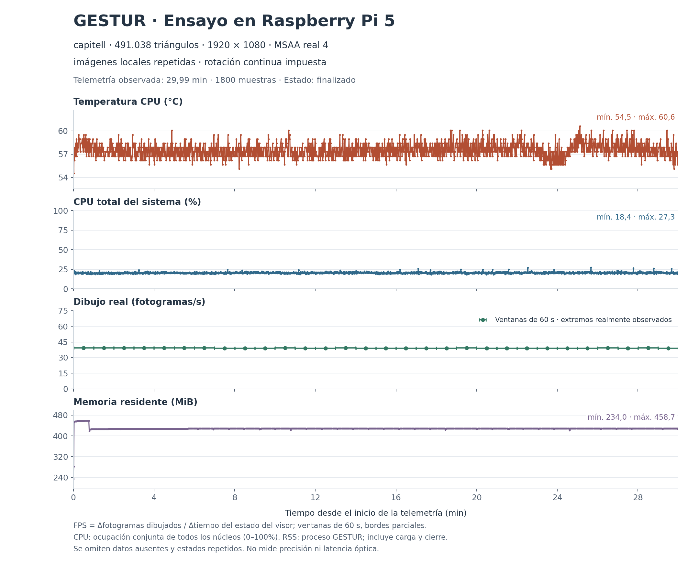

# Validación en Raspberry Pi 5

Mediciones del 27 de septiembre de 2026 en una **Raspberry Pi 5 de 4 GB**, con
Raspberry Pi OS Lite de 64 bits / Debian 13 trixie, kernel
`6.18.50+rpt-rpi-2712`, cámara UGREEN USB, HDMI de 1920 × 1080 y ventilación
`pwm-fan`. Python 3.12.14; las inferencias se ejecutaron en CPU ARM64.

El capitel original, con 491.038 triángulos y textura 2048 × 2048, se dibujó a
38,62 FPS con cámara y seguimiento activos en una prueba de 60 segundos a 1080p.
La CPU media del proceso fue 73,45 % de un núcleo y la temperatura máxima,
59,5 °C. En una prueba separada de **30 minutos**, con una fotografía repetida
para la inferencia y giro continuo impuesto, se midieron **39,18 FPS**, CPU total
media de **20,53 %** y temperatura máxima de **60,6 °C**. Ambas pruebas conservaron
la calidad gráfica y registraron `get_throttled=0x0` en todas sus muestras.

En ensayos separados sin visor, añadir manos a Pose reduce la cadencia observada
de pose de 18,45 a 7,33 FPS bajo el
presupuesto de inferencia configurado. MobRecon se ha convertido y ejecutado
correctamente en la Pi, pero su inferencia de una mano es más lenta que la red
Lite actual en las pruebas descritas. Ninguna de estas mediciones demuestra
mayor precisión ni valida todos los gestos.

Tras actualizar y reiniciar, una nueva prueba de 60 segundos con cámara y
capitel terminó a **38,22 FPS**, sin errores ni throttling. Sus condiciones y
límites se documentan por separado: no prolonga a 30 minutos la validación del
código más reciente ni permite comparar precisión o mejoras de rendimiento.

El [manifiesto de resultados](benchmarks/pi5/manifest.json) identifica los JSON
originales, los agregados calculados y las copias de pruebas del portal con el
SSID o la dirección local omitidos. Registra los hashes y el código de medición.
No se publican imágenes de la cámara, trazas voluminosas, direcciones de red ni
credenciales.

## Selección y gestión de modelos

La actualización de gestión del 27 de septiembre se comprobó en la misma Pi.
Tras un reinicio real, el capitel importado volvió a aparecer sin modificar la
selección ni los parámetros guardados. Su GLB conserva los 491.038 triángulos
y el JPEG original byte por byte; el OBJ, el material y la textura del archivo
subido coinciden con los de [examples/capitel](../examples/capitel/README.md).

Una importación de prueba permitió verificar el cambio de nombre, la orientación
guardada y su actualización en vivo en el visor. El hash del GLB no cambió.
Al borrar esa importación mientras estaba seleccionada, el visor volvió al
capitel y los parámetros permanecieron intactos. Estas son comprobaciones de
funcionamiento, no nuevas mediciones de rendimiento.

## Cómo interpretar las unidades

- **CPU del proceso:** 100 % representa un núcleo ocupado, no toda la Pi. En sus
  cuatro núcleos, 61,11 % equivale aritméticamente a 15,28 % de la capacidad
  conjunta; no es una medición del uso total del sistema.
- **Milisegundos de CPU:** suma de trabajo de los hilos durante una inferencia.
  Dos hilos pueden reducir tiempo transcurrido y aumentar tiempo de CPU.
- **Memoria:** los benchmarks de motores usan pico RSS en MB decimales.
  `pose_hand_tracker.py` denomina `process_peak_rss_mb` a una cantidad calculada
  en **MiB**; la tabla de cámara mantiene esa unidad explícita. No es memoria
  actual, tamaño de pesos ni consumo de la aplicación completa.
- **Presupuesto 0,6:** limita tiempo de pared dedicado conjuntamente a pose y
  manos. No impone un máximo del 60 % de CPU ni garantiza la cadencia solicitada.
- La edad del fotograma empieza después de `VideoCapture.read()`. No incluye
  exposición ni todo el búfer del dispositivo y no mide cámara→pantalla.

## Visor, capitel y seguimiento funcionando juntos

Se restauró el capitel de `main` exclusivamente como modelo de prueba externo al
catálogo del portal. La escena cargada tiene 491.038 triángulos, un lote de
geometría y textura original/cargada de 2048 × 2048. Ventana visible a pantalla
completa de 1920 × 1080, renderer **V3D 7.1.7.0**, cursor oculto, objetivo de
60 FPS y MSAA solicitado de 2 muestras; el framebuffer real ofrece **4 muestras**.
No se simplificó la geometría ni se redujo la textura.

La prueba usó la cámara real y el controlador instalado, con Pose Lite y manos
Lite activas, límites de 24/15 FPS y presupuesto de inferencia de 0,6. Los gestos
controlaban el objeto; no había rotación impuesta. Se completaron 60,017 s de
bucle y 60,220 s incluyendo cierre, sin abortar.

| Medida | Resultado |
| --- | ---: |
| Dibujo medio | 38,62 FPS |
| Bucle de control medio | 39,99 Hz |
| Intervalo entre dibujos, p50 / p95 / p99 | 32,42 / 34,11 / 35,74 ms |
| CPU media del proceso desde 5 s, % de un núcleo | 73,45 % |
| CPU media total del sistema desde 5 s | 21,28 % |
| Temperatura inicial / final / máxima | 54,55 / 59,50 / 59,50 °C |
| Fotogramas capturados / pose / manos | 1.300 / 373 / 302 |
| Fallos de captura | 0 |

Las medias de CPU son aritméticas sobre 56 muestras, aproximadamente una por
segundo desde el segundo 5; excluyen valores ausentes. Las 61 lecturas térmicas
cubren desde el arranque hasta el segundo 60,010. Todas registraron `get_throttled=0x0`; no hubo errores
del muestreador ni del runtime en la telemetría. Estos 60 segundos no sustituyen
la prueba térmica prolongada ni una evaluación de precisión de los gestos.
Los FPS son la frecuencia medida de dibujo, no una medición óptica de pantalla.

Fuentes: [escena y condiciones](benchmarks/pi5/capitel-camera/manifest.json),
[resumen original](benchmarks/pi5/capitel-camera/summary.json) y
[agregados de telemetría](benchmarks/pi5/capitel-camera/telemetry-summary.json).
Se conserva el hash del JSONL completo sin añadir la traza al repositorio.

### Cámara y capitel después del reinicio final

Con el despliegue de `549ca43` y los iconos de `9786282`, una nueva ejecución
completó **60,031 s** de bucle y 60,267 s incluyendo cierre, con código de salida
0. Se mantuvieron el capitel de 491.038 triángulos, su textura 2048 × 2048,
pantalla visible a 1920 × 1080, V3D 7.1.7.0 y MSAA real de 4 muestras (2
solicitadas). La cámara fue real y solo los controles movían el modelo.

| Medida | Resultado |
| --- | ---: |
| Dibujo medio / control medio | 38,22 FPS / 40,15 Hz |
| Intervalo entre dibujos, p50 / p95 / p99 | 32,28 / 34,18 / 91,60 ms |
| CPU media del proceso desde 5 s, % de un núcleo | 74,03 % |
| CPU media total del sistema desde 5 s | 21,64 % |
| Temperatura máxima / lecturas con throttling | 61,7 °C / 0 de 61 |
| RSS final / máximo muestreado | 428,52 / 461,45 MiB |
| Captura / inferencias de pose / de manos | 1.105 / 407 / 302 |

Las medias de CPU usan 56 muestras desde el segundo 5; no son las últimas
lecturas del resumen. No hubo fallos de captura ni errores del muestreador,
runtime o seguimiento, y todas las lecturas de throttling fueron `0x0`. Al final,
las manos estaban en búsqueda a 3 FPS (`hand_idle=true`); esta prueba no acredita
seguimiento persistente de dos manos ni precisión de gestos. La escena humana
no fue controlada para compararla con el ensayo anterior, por lo que no se
atribuye la diferencia de FPS o CPU a los cambios de código.

El operador verificó que los hashes SHA-256 de los once archivos de runtime y
benchmark enumerados en el manifiesto global coinciden entre la Pi y el
checkout; estos también coinciden con `9786282`. La sesión normal volvió después
a la bienvenida, sin modelo, con seguimiento detenido y sin error. Esta
comprobación de 60 segundos no sustituye un ensayo prolongado de ese despliegue.

Fuentes: [condiciones originales](benchmarks/pi5/capitel-camera-final/manifest.json),
[resumen original](benchmarks/pi5/capitel-camera-final/summary.json) y
[agregado de telemetría](benchmarks/pi5/capitel-camera-final/telemetry-summary.json).
Los originales se conservan sin modificaciones y el hash de la traza completa,
fuera de Git, figura en el manifiesto global.

## Ensayo sostenido de 30 minutos con el capitel

El proceso completó **1.800,011 s** de bucle y 1.800,180 s incluyendo cierre,
con resultado `completed`, código de salida 0 y sin solicitar aborto. Se mantuvo
el capitel original de 491.038 triángulos, su textura de 2048 × 2048, pantalla
completa de 1920 × 1080, V3D 7.1.7.0 y MSAA real de 4 muestras. No hubo
simplificación de geometría ni reducción de textura.

Pose Lite y manos Lite procesaron una fotografía repetida a 24 FPS, adaptada a
640 × 480. El giro continuo impuesto después de los controles mantuvo el trabajo
gráfico. Se conservaron los límites de inferencia de 24/15 FPS, presupuesto
conjunto de 0,6 y configuración de ensayo independiente. **Fue una carga de
replay, no una sesión de 30 minutos con cámara ni movimientos humanos reales.**

El despliegue medido correspondía a `35f8383`, antes de los controles añadidos
después del ensayo. Los archivos del controlador, seguimiento, visor, métricas,
configuración y benchmark son idénticos a los de `7a40706`; sus hashes se
registran en el [manifiesto de resultados](benchmarks/pi5/manifest.json).
Esto identifica la versión medida y no certifica cambios posteriores. El ensayo
de 60 segundos de las nuevas entradas descrito más abajo sí usó el seguimiento
de `003482b`; es una comprobación de contratos separada de esta referencia térmica.

| Medida | Resultado |
| --- | ---: |
| Dibujo medio / control medio | 39,18 FPS / 39,18 Hz |
| FPS por ventanas de 60 s, mínimo / máximo | 39,03 / 39,42 |
| FPS en los últimos 300 s observados | 39,13 |
| CPU media del proceso desde 5 s, % de un núcleo | 73,64 % |
| CPU media total del sistema desde 5 s | 20,53 % |
| Temperatura inicial / final / máxima | 56,20 / 57,30 / 60,60 °C |
| RSS final / máximo muestreado | 426,50 / 458,73 MiB |
| RSS medio en los últimos 300 s observados | 428,57 MiB |
| Fotogramas de replay / inferencias de pose / de manos | 42.412 / 10.267 / 10.267 |
| Muestras térmicas / lecturas con throttling | 1.800 / 0 |

Las 1.800 muestras cubren del segundo 0,001 al 1.799,453. Las medias de CPU
usan 1.795 muestras válidas desde el segundo 5; son medias aritméticas, no
integrales temporales. La CPU del sistema se mide por separado de la del proceso.
Temperatura y RSS incluyen el arranque del runtime. No hubo registros malformados,
errores del muestreador, errores del runtime ni del seguimiento. Todas las
lecturas de `get_throttled` fueron `0x0`, incluidos sus indicadores históricos.

Los FPS de cada ventana se calculan dividiendo el incremento de dibujos por el
tiempo entre sus estados de runtime primero y último, eliminando estados
repetidos. No se usa el promedio acumulado, no se interpolan bordes ni se añade
un punto inicial ficticio. Los extremos exactos constan en la
[tabla de 60 segundos](benchmarks/pi5/capitel-endurance/windows-60s.md), su
[CSV](benchmarks/pi5/capitel-endurance/windows-60s.csv) y el
[agregado JSON](benchmarks/pi5/capitel-endurance/telemetry-summary.json).
Los percentiles del resumen original conservan únicamente los últimos 18.000
intervalos; no describen todos los dibujos de los 30 minutos.

El contador de fallos de captura fue cero en todas las muestras y uno tras el
cierre, como en los otros ensayos de replay. Se conserva esa diferencia; el
lector devuelve fin de captura al recibir la orden de detenerse.



El resultado documenta la carga térmica y de recursos durante este ensayo con
esta refrigeración. No demuestra precisión de gestos, consumo en vatios,
latencia óptica, un cuello de botella concreto ni estabilidad indefinida.
Tampoco alcanza el objetivo de 60 FPS. La comprobación posterior del reinicio
y del portal instalado se documenta en la sección de arranque gráfico.

Fuentes sin modificar: [condiciones y escena](benchmarks/pi5/capitel-endurance/manifest.json)
y [resumen final](benchmarks/pi5/capitel-endurance/summary.json). El JSONL completo
se conserva fuera de Git: 4.071.285 bytes, SHA-256
`3217ddd15b3210fb010d1e7f2124c514f1fd4c44ca56c2fd6cf08bb3b68cc204`.
El [agregador](../scripts/research/aggregate_pi_trial.py) reproduce los JSON y las
tablas a partir de esos datos; el [script del gráfico](../scripts/research/plot_pi_system.py)
genera la figura.

## Ensayo de cuatro configuraciones del reloj de Panda3D

Cada caso duró aproximadamente 20 segundos con el mismo capitel, pantalla,
antialiasing y sincronización vertical. Se repitió la fotografía oficial de dos
manos a 24 FPS, adaptada a 640 × 480, y se impuso giro continuo al objeto después
de aplicar los controles. Esta carga es reproducible, pero no mide movimientos
reales ni es equivalente a la prueba anterior con cámara.

| Reloj | Dibujo medio, FPS | Intervalo p95, ms | CPU media desde 5 s, % de un núcleo |
| --- | ---: | ---: | ---: |
| Limitado a 60 | 39,37 | 33,89 | 72,50 |
| Limitado a 61 | 39,49 | 33,92 | 72,30 |
| Limitado a 120 | 39,32 | 33,94 | 72,45 |
| Normal, sin límite de reloj | 39,54 | 33,93 | 71,96 |

Son ajustes del reloj de tareas, no de la frecuencia del procesador. La diferencia
de 0,22 FPS entre extremos no ofrece una mejora útil observada. Se descarta
aplicar este cambio basándose en estas pruebas; **todavía no se ha identificado
la causa del límite de rendimiento**, incluida la posible contribución de GPU.
No se modificó la calidad gráfica ni se desactivó la sincronización vertical.

Los cuatro procesos finalizaron correctamente. El contador final de fallos de
captura, leído tras el cierre, es uno; en todas las muestras de replay durante
la ejecución fue cero. Se conserva esa diferencia; estos
casos no utilizaron la webcam. La temperatura máxima fue 60,6 °C y todas las
lecturas de throttling fueron `0x0`.

Fuentes por caso: [60](benchmarks/pi5/clock-limited60/manifest.json),
[61](benchmarks/pi5/clock-limited61/manifest.json),
[120](benchmarks/pi5/clock-limited120/manifest.json) y
[normal](benchmarks/pi5/clock-normal/manifest.json). Cada directorio conserva el
resumen original y el agregado de telemetría, con sus hashes en el manifiesto.

### Aislamiento del seguimiento y del callback de métricas

Dos pruebas adicionales conservaron el capitel original, 1080p, MSAA real de
4 muestras, VSync y movimiento continuo:

- **Solo renderizado:** 45,549 FPS y CPU media del proceso de 5,35 % de un núcleo
  durante 20,0002 s, después de 0,5 s de calentamiento. No se inició cámara ni
  inferencia. El contador de dibujo permaneció activo; sus percentiles incluyen
  el calentamiento, mientras que la CPU y los FPS citados lo excluyen.
- **Seguimiento con replay y sin callback de dibujo:** 39,39 envíos estimados
  por segundo durante unos 20 s, con 107 inferencias de pose y 107 de manos.
  La CPU media desde el segundo 5 fue 72,30 % de un núcleo; el valor de 70,33 %
  del resumen es la última lectura del runtime, no esa media. Los campos
  heredados `render_fps`, `frames` y `frame_ms_*` cuentan aquí una tarea posterior
  a `igLoop`: **no verifican recorridos de dibujo ni presentación en pantalla**.

El ensayo sin seguimiento muestra una carga distinta y tampoco alcanza 60 FPS.
No se midió ocupación ni tiempo de GPU, por lo que no determina el cuello de
botella. Retirar el callback no produjo una mejora útil del ritmo observado.
Se conservan el reloj y la instrumentación de producción.

Fuentes: [renderizado aislado](benchmarks/pi5/capitel-render-only.json),
[condiciones sin callback](benchmarks/pi5/capitel-no-callback/manifest.json),
[resumen](benchmarks/pi5/capitel-no-callback/summary.json) y
[telemetría agregada](benchmarks/pi5/capitel-no-callback/telemetry-summary.json).
Los [tres scripts de diagnóstico](../scripts/research/README.md#comparaciones-de-renderizado)
quedan conservados con sus hashes para repetir estas comparaciones.

## Portal, Wi-Fi y arranque gráfico

La comprobación del portal en **HTTP 80**, con la corrección de importación
nativa `549ca43`, completó sus **11 pruebas de API en
30,2 s**: sesión de acceso, catálogo vacío y sin modelo activo, runtime conectado,
configuración inicial, Wi-Fi abierto, añadir/cambiar/eliminar contraseña,
restauración de la red abierta, configuración sin cambios y cierre de sesión.
No quedan contraseñas de prueba activas. Este
[resultado final](benchmarks/pi5/portal-http80/api-smoke.redacted.json) se conserva
separado del [ensayo anterior de 30,14 s](benchmarks/pi5/api-smoke.redacted.json).
La lectura puntual de FPS incluida en la API no es un benchmark de rendimiento.

La [prueba final de importación](benchmarks/pi5/portal-http80/import-smoke.redacted.json)
subió un ZIP con OBJ, MTL y PNG a través del portal instalado. La conversión
nativa produjo un GLB de 2.068 bytes con dos triángulos, UV y textura de 2 × 2
verificada. Se reparó una ruta de textura de Windows con diferencias de
mayúsculas. La prueba eliminó únicamente su paquete y conservó el registro
terminal del trabajo; dejó vacía la biblioteca, sin seleccionar modelo ni
modificar parámetros.

Las copias publicadas omiten el SSID de la API y la dirección local del ensayo
de importación. Todos los resultados y tiempos se conservan; el
[manifiesto final](benchmarks/pi5/portal-http80/manifest.json) identifica los
campos omitidos y los hashes tanto originales como publicados.

Se corrigió la selección de dispositivo DRM de Xorg: en Pi 5, `vc4` controla las
salidas de pantalla y `v3d` proporciona render. La
[regla instalada](../deployment/99-gestur-vc4.conf) selecciona `modesetting`
sobre `vc4` como GPU principal, sin asumir si corresponde a `card0` o `card1`.
El [instalador](../scripts/configure-xorg.sh) incorpora la corrección del commit
`dcb57f6`. **El reinicio real y el arranque automático quedaron comprobados**
después del despliegue de `549ca43` y la revisión de iconos `9786282`. Según la observación del operador,
el identificador de arranque cambió y, al revisar el sistema con 21,56 s de
actividad, el controlador se había iniciado automáticamente, el portal estaba
activo y su `ExecStartPre` había terminado con código 0. Ese tiempo es el momento
de inspección, no una medida de latencia de arranque.

La misma revisión confirmó **V3D 7.1.7.0, Mesa 26.2.2 y aceleración activa**;
HTTP respondió 200 tanto por mDNS como por IPv4. El runtime mostraba bienvenida,
sin modelo seleccionado ni dibujado, seguimiento detenido y ningún error.
Además, se ejecutó la función instalada `portal_url()`: devolvió una URL con
esquema `http`, sin puerto explícito y con la dirección del punto de acceso,
no una dirección de loopback. Se comprobó así el destino generado para el QR;
**no se realizó un escaneo físico del QR**.
Estas comprobaciones se registran explícitamente como observaciones del
operador, no como un JSON original de captura; no se publican identificadores
de arranque ni direcciones de red. Verifican el arranque tras la instalación
manual. **El proceso completo de imagen preparada e instalación en su primer
arranque sigue pendiente.**

## Captura y seguimiento con cámara USB

Dos procesos independientes de 60 segundos, cámara 0, tamaño solicitado
640 × 480, espejo activo, Pose Lite a un máximo de 24 FPS y manos a 15 FPS.
Cada prueba excluye creación de cámara/modelos y cierre del tiempo medido;
no participa el renderizador. El arranque registrado fue 1,07 s para pose y
0,83 s para pose+manos; no son mediciones controladas de arranque en frío.

| Configuración | FPS captura | FPS pose | FPS manos | CPU, % de un núcleo | Pico RSS, MiB |
| --- | ---: | ---: | ---: | ---: | ---: |
| Pose Lite | 19,20 | 18,45 | 0 | 61,11 | 222,69 |
| Pose Lite + manos Lite | 19,30 | 7,33 | 7,33 | 62,52 | 283,17 |

| Configuración | Ciclo de inferencia mediana / p95, ms | Edad de imagen mediana / p95, ms | Fallos de captura |
| --- | ---: | ---: | ---: |
| Pose Lite | 30,83 / 37,96 | 51,40 / 77,50 | 0 |
| Pose Lite + manos Lite | 77,22 / 96,72 | 107,74 / 140,31 | 0 |

Estos percentiles muestrean a 20 Hz la última inferencia completada; no son un
registro independiente de cada red ni una latencia visual. La segunda fila
incluye el trabajo combinado de pose y manos. No debe restarse una fila de otra
para obtener un benchmark aislado de manos.

Hubo 1.198 observaciones de validez por prueba. Cabeza válida: 98,91 % en ambas.
Con manos activadas, izquierda válida: 98,33 %; derecha: 1,84 %. **Esta muestra no
representa seguimiento persistente de dos manos**, ni permite determinar si una
ausencia corresponde a oclusión, falta de una mano visible o error del modelo.
Los indicadores `detected` no son anotaciones de precisión.

Fuentes: [pose](benchmarks/pi5/camera-pose.json) y
[pose+manos](benchmarks/pi5/camera-pose-hands.json).

Un coste relevante queda explicado por el
[grafo oficial de MediaPipe 0.10.18](https://github.com/google-ai-edge/mediapipe/blob/v0.10.18/mediapipe/tasks/cc/vision/hand_landmarker/hand_landmarker_graph.cc#L259):
en VIDEO vuelve a ejecutar el detector de palmas si sigue menos manos que el
máximo configurado. Con `num_hands=2` y una sola mano seguida, la búsqueda de
palmas se repite en cada llamada. Esto justifica investigar una búsqueda menos
frecuente de nuevas manos, pero no demuestra qué proporción exacta de esta prueba
consume el detector. No se cambió a una mano fija ni se alteró ese grafo.

## Contratos de torso y proximidad de manos tras el despliegue

El seguimiento instalado de `003482b` completó **60,0002 s** de replay con
resultado `passed`. Los hashes de los cinco archivos de seguimiento,
extractores y esquema registrados por la prueba coinciden con ese commit. Esta
versión incorpora las ocho entradas nuevas y es posterior al seguimiento
medido durante los 30 minutos del capitel (`35f8383`). **No son dos mediciones
comparables de rendimiento ni una prueba térmica del nuevo despliegue.**

Se repitió la fotografía oficial `woman_hands.jpg`, de 640 × 960, adaptada sin
deformar a 640 × 480 y entregada a 24 FPS. Pose Lite y manos Lite ejecutaron
inferencia nativa en CPU, con máximos solicitados de 24/15 FPS y presupuesto
conjunto de 0,6. La demanda de pose incluía solo `torso`. Dos sistemas de
controles independientes consumieron el mismo seguimiento para comprobar la
proximidad de cada mano. No se inició cámara ni visor y no se modificó la
configuración de producción.

| Entradas comprobadas | Valores finitos por entrada | Ausentes por entrada | Inválidos / fuera de rango |
| --- | ---: | ---: | ---: |
| `torso_x`, `torso_y`, `torso_scale`, `torso_pitch`, `torso_yaw`, `torso_roll` | 179 | 179 | 0 / 0 |
| `left_hand_scale`, `right_hand_scale` | 358 | 0 | 0 / 0 |

Son **358 publicaciones del seguimiento**, que pueden incluir caducidad de
estado; no son fotogramas independientes ni anotaciones de precisión. `passed`
significa que las ocho entradas tuvieron cobertura finita y no hubo errores de
contrato, no que todas estuvieran disponibles continuamente. La prueba no
establece la causa de las ausencias de torso. Las proximidades se mantuvieron
en el intervalo 0–1; siguen siendo medidas relativas monoculares, no metros.
Cada sistema de controles produjo 1.192 salidas finitas.

Pasaron las cinco comprobaciones de demanda: ambos perfiles solicitan los
mismos detectores, la presencia solicitada es torso, desactivar pose conserva
solo manos y la ausencia de modelo o el modo sin cámara desactivan el seguimiento.
**No hubo ninguna publicación con torso detectado y cabeza ausente**, por lo
que no se verificó con esta imagen el caso de cabeza ocluida. Tampoco se evaluó
precisión de movimientos, recuperación tras oclusiones ni latencia visual.

Se registraron 358 inferencias de pose y 358 de manos antes del cierre, CPU
media del proceso de 64,53 % de un núcleo durante el bucle y pico RSS de
298,68 MB decimales, que incluye la preparación. Son observaciones de esta
carga sin visor; no demuestran una mejora de CPU o memoria. El contador de
fallos de captura fue cero antes del cierre y uno tras detener el replay; se
conservan ambas lecturas.

Fuentes: [resultado original sin modificar](benchmarks/pi5/new-inputs/summary.json),
[manifiesto, hashes y condiciones](benchmarks/pi5/new-inputs/manifest.json) y
[script exacto de la prueba](../scripts/research/benchmark_new_inputs.py).
Para repetirla desde la raíz del repositorio, con los modelos instalados y una
copia local de la fotografía identificada por el manifiesto:

```sh
.venv/bin/python scripts/research/benchmark_new_inputs.py --project . --source replay --image /ruta/woman_hands.jpg --seconds 60 --output /tmp/new-inputs-replay.json
```

El archivo de salida debe ser nuevo. El script no instala dependencias ni
modifica parámetros del portal.

## Motores de manos: trabajos diferentes

Cada proceso realizó **20 iteraciones de calentamiento y 180 medidas**.
NumPy 1.26.4, OpenCV 4.11.0 con un hilo. LiteRT 2.2.0 retuvo simultáneamente
los dos modelos Lite e invocó cada red sobre un tensor sintético constante.
MediaPipe 0.10.18 recibió repetidamente una fotografía preparada a 640 × 480,
en modo VIDEO y con límite de dos manos. Son cargas diferentes.

| Motor y operación | Hilos solicitados | Mediana / p95, ms | CPU mediana, ms | Pico RSS del proceso, MB |
| --- | ---: | ---: | ---: | ---: |
| LiteRT: detector de palma | 1 | 26,25 / 26,34 | 26,25 | 133,10 |
| LiteRT: puntos de una mano | 1 | 12,41 / 12,44 | 12,41 | 133,10 |
| LiteRT: detector de palma | 2 | 14,90 / 15,07 | 29,66 | 130,93 |
| LiteRT: puntos de una mano | 2 | 7,16 / 7,19 | 14,24 | 130,93 |
| MediaPipe Tasks: fotografía con dos manos | Por defecto | 28,94 / 30,72 | 31,73 | 191,01 |

El RSS de LiteRT es el del proceso con **ambas** redes residentes; las dos filas
del mismo número de hilos no se suman. MediaPipe detectó dos manos en las
180 iteraciones medidas. La detección de palmas puede omitirse mientras Tasks
conserva suficientes manos seguidas.

LiteRT aquí no hace NMS, recortes orientados, asociación, recuperación ni gestos.
El tiempo de Tasks incluye su cadena interna, pero excluye captura,
decodificación y preparación de la fotografía. **No se puede dividir estos
tiempos para anunciar una mejora de velocidad del producto.** El menor RSS del
prototipo LiteRT tampoco representa un ahorro demostrado con funcionalidad
equivalente. Con dos hilos baja la espera y aumenta el trabajo de CPU por red.

El lanzador registró 8,36 s para LiteRT de un hilo, 4,70 s para dos y 7,65 s
para Tasks, incluyendo trabajo fuera de las iteraciones cronometradas.
Antes/después de estos comandos: 49,4→54,3 °C, 53,8→56,0 °C y 56,5→53,8 °C,
respectivamente; `get_throttled=0x0` en todos esos extremos. Son pruebas breves,
en secuencia y con temperaturas iniciales diferentes: no prueban ahorro térmico,
consumo eléctrico ni estabilidad sostenida.

Fuentes: [LiteRT 1 hilo](benchmarks/pi5/lite-1.json),
[LiteRT 2 hilos](benchmarks/pi5/lite-2.json),
[Tasks](benchmarks/pi5/mediapipe-default.json) y
[temperaturas del lanzador](benchmarks/pi5/runtime-summary.json).

## MobRecon: arquitectura 3D distinta

Se usaron el código de los autores, su checkpoint DenseStack + DSConv y las
plantillas públicas para exportar ONNX opset 17. No se descargó ni cargó
`MANO_RIGHT.pkl`. La carga del checkpoint fue estricta y se conservó el orden
espiral del algoritmo original. Esto comprueba viabilidad técnica; las
condiciones de distribución de las plantillas deben revisarse antes de incluirlas
en el producto.

ONNX Runtime 1.30.0, `CPUExecutionProvider`, ejecución secuencial, un hilo
inter-op y espera activa intra/inter desactivada. Cada prueba: **20 iteraciones
de calentamiento y 180 medidas**, en procesos independientes. Entrada: un único
recorte de mano de los autores, preparado en RGB 128 × 128 y normalizado a
[-1, 1]. No hay detector, segunda mano, asociación, cámara ni visor.

| Hilos intra-op | Mediana / p95, ms | CPU mediana, ms | Pico RSS, MB | Temperatura antes→después |
| ---: | ---: | ---: | ---: | ---: |
| 1 | 69,20 / 69,56 | 69,23 | 179,03 | 50,5→53,8 °C |
| 2 | 49,05 / 49,28 | 81,63 | 179,78 | 53,8→54,3 °C |

`get_throttled=0x0` antes y después de ambos comandos. El lanzador no registró
su duración total.
Las salidas fueron finitas: malla `(1,778,3)` y puntos 2D `(1,21,2)`.
El error máximo frente a PyTorch fue `3,35e-7` en la malla y `2,38e-7` en los
puntos. **Es paridad de conversión sobre la muestra, no precisión 3D.**

En estas condiciones, MobRecon consume más tiempo por recorte que la red Lite
de puntos de mano, aunque produce una malla más rica y las entradas de ambos
ensayos no son equivalentes. Aún necesitaría detección y seguimiento para Gestur.
No hay evidencia de una ventaja de consumo que justifique sustituir el modelo
actual; tampoco una comparación de calidad que permita descartar su utilidad
para otros objetivos.

Fuentes: [1 hilo](benchmarks/pi5/mobrecon-1.json),
[2 hilos](benchmarks/pi5/mobrecon-2.json),
[temperaturas](benchmarks/pi5/mobrecon-summary.json) y
[procedencia y contrato del modelo](benchmarks/pi5/mobrecon-provenance.json).

## Cabeza: comparación sobre los mismos fotogramas reales

Durante 45,001 s se midieron 135 imágenes compartidas entre candidatos, después
de tres fotogramas de calentamiento. Cámara real 640 × 480, espejo, máximo de
tres fotogramas por segundo y orden de ejecución rotatorio. Se guardaron solo estadísticas.

| Modelo | Mediana / p95, ms | CPU mediana, ms | Muestras válidas |
| --- | ---: | ---: | ---: |
| Pose Lite, cabeza | 39,20 / 46,12 | 41,36 | 135/135 |
| FaceDetection Short Range | 5,85 / 8,32 | 5,98 | 131/135 |
| FaceDetection Full Range Sparse | 18,93 / 22,06 | 20,00 | 0/135 |
| FaceLandmarker, matriz facial activa | 27,83 / 33,02 | 29,47 | 113/135 |

Las 113 detecciones de FaceLandmarker tuvieron matriz finita. El detector corto
es rápido, pero aporta puntos 2D y no sustituye los tres giros. FaceLandmarker
dejó de detectar en 22 imágenes donde Pose detectó cabeza. Full Range Sparse
no detectó en esta muestra; su latencia no representa seguimiento funcional.
No se cambió el backend de producción.

No hay referencia externa de orientación: presencia y acuerdo no equivalen a
precisión. Los candidatos estuvieron residentes simultáneamente; el pico conjunto
de 302,87 MB y CPU conjunta de 31,00 % de un núcleo no corresponden a un backend
individual. Sus tiempos excluyen adquisición y preparación RGB compartida y no
son comparables sin más con los 30,83 ms de la prueba separada de Pose.

Fuente: [comparación facial con cámara](benchmarks/pi5/face-camera.json).

## Reproducción y archivos exactos

Los [modelos Lite fijados](../tracking_models/manifest.json) se preparan mediante
`scripts/provision_models.py`. Antes de medir, comprobar los archivos:

```sh
cd /opt/gestur
.venv/bin/python scripts/provision_models.py --check
.venv/bin/python pose_hand_tracker.py --seconds 60 --camera 0 --output /tmp/camera-pose.json
.venv/bin/python pose_hand_tracker.py --seconds 60 --camera 0 --hands --output /tmp/camera-pose-hands.json
```

La cámara debe estar libre y la persona presente en los ensayos activos.
Una escena vacía mide principalmente el sondeo de ausencia. No ejecutar
benchmarks simultáneamente ni confundir estas herramientas sin visor con la
aplicación completa.

Para repetir el ensayo completo, usar una sesión Xorg acelerada, la cámara libre
y ningún otro visor en paralelo. El directorio de salida debe ser nuevo:

```sh
.venv/bin/python scripts/benchmark_pi_system.py --source camera --duration 60 --model /ruta/capitel-original/capitell.obj --motion controls --output-dir /tmp/capitel-camera-new
```

El OBJ medido tiene SHA-256
`dc6b46d861b0402a54041ffbed5ee7021dcc3f3872a7cd51599e9bd4b60d76d6`;
su MTL y textura deben permanecer junto al archivo. Esta herramienta conserva
las políticas reales del controlador y usa configuración de prueba aislada.

Para motores, usar el entorno correspondiente y procesos nuevos:

```sh
python scripts/benchmark_hand_runtime.py --mode lite --models-dir tracking_models --threads 1 --frames 180 --warmup 20 --output /tmp/lite-1.json
python scripts/benchmark_hand_runtime.py --mode lite --models-dir tracking_models --threads 2 --frames 180 --warmup 20 --output /tmp/lite-2.json
python scripts/benchmark_hand_runtime.py --mode mediapipe --models-dir tracking_models --image /ruta/woman_hands.jpg --frames 180 --warmup 20 --output /tmp/mediapipe-default.json
```

La [fotografía oficial de MediaPipe](https://storage.googleapis.com/mediapipe-assets/woman_hands.jpg)
tiene SHA-256 `70cbeb38e198c9862202e0979c21a99b40ca980d3e7b250176c85b1636a40f12`.
El bundle de manos Lite: `28984ffd6aaf10e44a054356a7e768806178bf1db084efe0aec9d636a7ed2c87`.

Para MobRecon, [código oficial fijado al commit](https://github.com/SeanChenxy/HandMesh/tree/3c87e958d4855f890e3884ec94bcfc0f99422c3d),
[checkpoint DenseStack + DSConv](https://drive.google.com/file/d/1qqEstFnV3GClpGWNEAZmR0jnxrcZH-9y/view)
y [recorte original](https://raw.githubusercontent.com/SeanChenxy/HandMesh/3c87e958d4855f890e3884ec94bcfc0f99422c3d/cmr/images/2299_img.jpg).
El [manifiesto](benchmarks/pi5/mobrecon-provenance.json) fija todos los recursos:

- Checkpoint: 45.656.319 bytes; SHA-256 `b3c18c68acca9e41fe8ac06a3ffdb0ea5526b024f5f5cc3ede906c93cf3598d7`.
- ONNX exportado: 33.629.637 bytes; SHA-256 `3c9af55cdb80b69decda8b29d77c405bbb90e3481ab5a9cd0045e0d96ab3f1b1`.
- Referencia preparada: SHA-256 `5f09f20f3e8d05f1e2bff96aff93b509617fdf73e6e457b78814b59fbfd12e33`.
- El grafo contiene 8.149.989 elementos inicializadores. El módulo PyTorch
  incluye 11.251.741 parámetros, con capas que esta ruta de inferencia no usa;
  no son medidas equivalentes. No es el modelo GhostStack del artículo.

Los [scripts experimentales y las instrucciones](../scripts/research/README.md)
se conservan en el repositorio, separados del runtime. El benchmark ONNX se llama
ahora `scripts/research/benchmark_mobrecon.py`; el exportador PyTorch está en
`scripts/research/mobrecon/export_mobrecon.py`. Son copias exactas de los scripts
medidos, con nombres distintos y hashes registrados. Se conservan las fuentes
necesarias y su licencia MIT, pero no los pesos, plantillas ni datos binarios.

La prueba de MobRecon usó `--threads 1` o `--threads 2`, con
`--frames 180 --warmup 20` y espera activa desactivada. La facial se reproduce con:

```sh
python scripts/research/benchmark_face_camera.py --project /opt/gestur --camera 0 --seconds 45 --fps 3 --warmup 3 --face-model /ruta/face_landmarker.task --output /tmp/face-camera.json
```
FaceLandmarker: 3.758.596 bytes, SHA-256
`64184e229b263107bc2b804c6625db1341ff2bb731874b0bcc2fe6544e0bc9ff`.

## Pendiente de completar

Queda pendiente el proceso completo de imagen preparada e instalación en el
primer arranque. La instalación manual, el reinicio y el arranque automático
gráfico y del portal sí están verificados. El ensayo térmico de 30 minutos está
completado con replay; no sustituye una sesión prolongada con visitantes y
cámara real. Tampoco se han medido
vatios, latencia óptica cámara→pantalla, error angular 3D, oclusiones anotadas,
dos manos persistentes ni pérdida y recuperación en secuencias reproducibles.

La decisión de mantener MediaPipe Lite se basa en que las alternativas medidas
no ofrecen todavía una mejora demostrada del conjunto conservando sus funciones.
Queda por probar si separar búsqueda de palmas y seguimiento de manos reduce
el coste sin perjudicar la detección de una segunda mano.
